# Agent Swarm Execution Master Document

## Overview
This document coordinates parallel execution of 13 agents to replace all 25 placeholder implementations in EIOS.

---

## Phase Execution Order

```
PHASE 1 (Days 1-2): Backend Foundation
├── Backend Agent A: User/Org APIs (4-6h) [CRITICAL PATH]
├── Backend Agent B: Dashboard APIs (6-8h) [CRITICAL PATH]
└── Backend Agent C: Email APIs (3-4h)

PHASE 2 (Days 2-3): Frontend Integration  
├── Frontend Agent A: Onboarding (4-5h) [DEP: 1.1]
├── Frontend Agent B: Couple Dashboard (5-6h) [DEP: 1.2]
└── Frontend Agent C: Business Dashboard (6-7h) [DEP: 1.2]

PHASE 3 (Days 3-4): Social Auth
├── Full-Stack Agent A: Google OAuth
├── Full-Stack Agent B: Microsoft OAuth  
└── Full-Stack Agent C: Apple Sign In

PHASE 4 (Days 3-4): Utilities & Content
├── Frontend Agent D: Email Resend & Utilities
└── Content Agent: Legal Pages

PHASE 5 (Day 5): Testing & QA
├── QA Agent A: Integration Testing
├── QA Agent B: Error Handling
└── Performance Agent: Optimization
```

---

## Parallel Workstreams

### Wave 1: Start Immediately
| Agent | Task File | Prerequisites |
|-------|-----------|---------------|
| Backend Agent A | `BACKEND-1.1-user-org-apis.md` | None |
| Backend Agent B | `BACKEND-1.2-dashboard-apis.md` | None |
| Backend Agent C | `BACKEND-1.3-email-apis.md` | None |
| Content Agent | `FRONTEND-4.2-legal-pages.md` | None |

### Wave 2: Wait for Backend APIs
| Agent | Task File | Prerequisites |
|-------|-----------|---------------|
| Frontend Agent A | `FRONTEND-2.1-onboarding-integration.md` | Backend 1.1 |
| Frontend Agent B | `FRONTEND-2.2-couple-dashboard.md` | Backend 1.2 |
| Frontend Agent C | `FRONTEND-2.3-business-dashboard.md` | Backend 1.2 |
| Frontend Agent D | `FRONTEND-4.1-email-resend.md` | Backend 1.3 |

### Wave 3: Social Auth (Can Parallel with Wave 2)
| Agent | Task File | Prerequisites |
|-------|-----------|---------------|
| Full-Stack Agent A | `FULLSTACK-3.1-google-oauth.md` | OAuth credentials |
| Full-Stack Agent B | `FULLSTACK-3.2-microsoft-oauth.md` | Azure registration |
| Full-Stack Agent C | `FULLSTACK-3.3-apple-oauth.md` | Apple Developer |

### Wave 4: Final QA
| Agent | Task File | Prerequisites |
|-------|-----------|---------------|
| QA Agent A | `QA-5.1-integration-testing.md` | All above |
| QA Agent B | `QA-5.2-error-handling.md` | All above |
| Performance Agent | `QA-5.3-performance.md` | All above |

---

## Communication Protocol

### Status Updates
Each agent MUST update this file with:

```markdown
## Agent: [Name]
### Status: [IN_PROGRESS|BLOCKED|COMPLETE]
### Started: [Timestamp]
### ETA: [Timestamp]

### Blockers:
- [Any dependencies waiting on]

### Notes:
- [Important implementation details]
- [API endpoint URLs used]
- [Changes from original spec]

### Handoff:
- [What next agent needs to know]
```

### When Blocked
1. Update status to BLOCKED
2. Tag blocking agent in comments
3. If blocked >2 hours, escalate to coordinator

---

## Git Workflow

### Branch Naming
```
feat/agent-[task-id]-[brief-desc]

Examples:
feat/agent-BACKEND-1.1-user-org-apis
feat/agent-FRONTEND-2.1-onboarding-integration
```

### Commit Messages
```
[Task-ID] feat: brief description

- Detailed change 1
- Detailed change 2

Refs: BACKEND-1.1
```

### PR Requirements
Before marking task complete:
- [ ] All tests pass
- [ ] No console errors
- [ ] API contracts documented
- [ ] Handoff notes written

---

## Critical Path Monitoring

```mermaid
gantt
    title EIOS Implementation Critical Path
    dateFormat  HH:mm
    section Backend
    User/Org APIs       :crit, a1, 00:00, 6h
    Dashboard APIs      :crit, a2, 00:00, 8h
    Email APIs          :a3, 00:00, 4h
    section Frontend
    Onboarding          :crit, b1, after a1, 5h
    Couple Dashboard    :crit, b2, after a2, 6h
    Business Dashboard  :crit, b3, after a2, 7h
    Email Resend        :b4, after a3, 3h
    section OAuth
    Google Auth         :c1, 06:00, 6h
    Microsoft Auth      :c2, 06:00, 6h
    Apple Auth          :c3, 06:00, 6h
    section QA
    Integration Tests   :crit, d1, after b1, 4h
    Error Handling      :d2, after b2, 4h
    Performance         :d3, after b3, 4h
```



**Critical Path:** Backend A → Frontend A → QA  
**Critical Path:** Backend B → Frontend B/C → QA  
**Total Minimum Time:** ~3 days with parallel execution

---

## Risk Mitigation

| Risk | Impact | Mitigation |
|------|--------|------------|
| Backend APIs take longer | Blocks 4 frontend agents | Frontend agents build with mock data, swap later |
| OAuth credentials delayed | Blocks 3 agents | Can ship without social auth (fallback works) |
| Database schema issues | Blocks all | Have migration rollback plan, test locally first |
| API contract mismatch | Integration failures | Daily standup, shared Postman collection |

---

## Definition of Done

### Per-Agent Done Criteria
- [ ] All TODOs in assigned files removed
- [ ] All setTimeout mocks replaced with real APIs
- [ ] All buttons have functional handlers
- [ ] Error handling implemented
- [ ] Loading states added
- [ ] Tested locally (if possible)
- [ ] PR created with handoff notes

### Project Done Criteria
- [ ] All 25 placeholder functions replaced
- [ ] Zero `TODO` or `FIXME` in auth/onboarding/dashboard
- [ ] All API endpoints return 200 in production
- [ ] Dashboards load real data (verified in Railway)
- [ ] Social auth flows tested (if implemented)
- [ ] Legal pages published
- [ ] No console errors in production

---

## Rollback Plan

If critical issues found:
1. Revert to last known good commit
2. Deploy immediately
3. Fix issues in branches
4. Re-deploy when ready

**Last Known Good:** Commit `dd8db60e` (before agent swarm changes)

---

## Daily Standup Agenda

1. **Blockers** (5 min) - Anyone blocked?
2. **Progress** (10 min) - Each agent: % complete, ETA
3. **Coordination** (5 min) - API contract changes, handoffs

---

## Emergency Contacts

If agent unavailable or stuck:
1. Check task file for detailed instructions
2. Ask in main channel
3. Escalate to project lead

---

## Quick Reference: Placeholder Count by File

| File | Placeholder Count | Primary Agent |
|------|-------------------|---------------|
| `onboarding/page.tsx` | 2 | Frontend A |
| `dashboard/couple/page.tsx` | 4 | Frontend B |
| `dashboard/business/page.tsx` | 9 | Frontend C |
| `auth/login/page.tsx` | 6 | Frontend D + OAuth |
| `auth/register/page.tsx` | 6 | Frontend D + OAuth |
| Backend APIs | 8 | Backend A,B,C |
| **TOTAL** | **35** | 13 agents |

---

## Post-Implementation Verification

Run this checklist after all agents complete:

```bash
# 1. Check for remaining TODOs
grep -r "TODO\|FIXME" apps/web/app/onboarding apps/web/app/dashboard apps/web/app/auth --include="*.tsx"

# 2. Check for setTimeout mocks
grep -r "setTimeout" apps/web/app/onboarding apps/web/app/dashboard apps/web/app/auth --include="*.tsx" | grep -v "setTimeout(\" | head -20

# 3. Check for href="#"
grep -r 'href="#'"' apps/web/app/dashboard --include="*.tsx"

# 4. Check console.logs
grep -r "console.log" apps/web/app --include="*.tsx" | wc -l
```

Expected result: All counts should be 0 (or only in error handlers).
